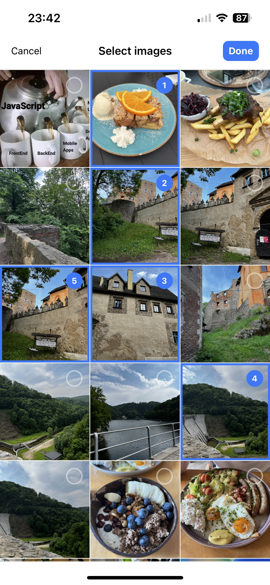

# React Native Image Select

## Overview

React Native Image Select component that allow to select photos from the device's library, similar to the component from current Facebook App.

- Smooth and fast cross platform image picker component for react-native
- Tested on IOS and Android
- Simple API
- Dependencies are [@react-native-camera-roll/camera-roll](https://github.com/react-native-cameraroll/react-native-cameraroll) and [react-native-permissions](https://github.com/zoontek/react-native-permissions)

<p align="left">
  
</p>

## Features 🔥

#### Current v0.1

- 🌄 Choose multiple images/videos
- 0️⃣ Selected order index.
- 🎨 Header customization
- 🔑 Built-in support for permissions  


#### Planned functionnality

- Limitations on the number of selected photos
- Ability to change view between grid and preview
- More modification options
- Ability to change the current album
- Preview image/video.

## Getting Started 🔧

```
yarn add react-native-image-select

```

### Required additional steps

Add @react-native-camera-roll/camera-roll

https://github.com/react-native-cameraroll/react-native-cameraroll#getting-started

and react-native-permissions

https://github.com/zoontek/react-native-permissions#setup

#### Required IOS Permissionss:

```
 "reactNativePermissionsIOS": [
    "PhotoLibrary",
  ],
```

**Info.plist**

```
...
  <key>NSPhotoLibraryUsageDescription</key>
  <string>YOUR TEXT</string>
...

```

#### Required Android Permissions:

**android/app/src/main/AndroidManifest.xml file:**

```
<manifest xmlns:android="http://schemas.android.com/apk/res/android">
  <!-- ... -->
  <uses-permission android:name="android.permission.READ_EXTERNAL_STORAGE" />
  <uses-permission android:name="android.permission.READ_MEDIA_IMAGES" />
<uses-permission android:name="android.permission.READ_MEDIA_VIDEO"/>
  <!-- ... -->
</manifest>

```

Add the `android:requestLegacyExternalStorage="true"` attribute to the `<application>` tag for Android 10 support.

## Usage 🚀

```jsx
import * as React from "react";
import {
  StyleSheet,
  View,
  Text,
  Button,
  Image,
  ScrollView,
  SafeAreaView,
  Dimensions,
} from "react-native";
import ImageSelect, { useImageSelect } from "../src";

export default function App() {
  const {
    callback,
    imageSelectRef,
    isImageSelectVisible,
    openImageSelect,
    onCancel,
    selectedImages,
    clearSelectedImages,
    onRemoveSelectedImage,
    onDone,
  } = useImageSelect();

  return (
    <SafeAreaView>
      <ScrollView>
        <View style={styles.container}>
          <Text style={styles.title}>react-native-image-select</Text>
          <View style={styles.button}>
            <Button title="Open ImagePicker" onPress={openImageSelect} />
          </View>

          <View>
            {selectedImages?.map((i) => (
              <View key={i.uri}>
                <Image source={{ uri: i.uri }} style={styles.image} />
                <Button
                  title="Remove image"
                  onPress={() => onRemoveSelectedImage(i.uri)}
                />
              </View>
            ))}
          </View>
          <Button title="Clear selected images" onPress={clearSelectedImages} />
          <ImageSelect
            ref={imageSelectRef}
            isVisible={isImageSelectVisible}
            onCancel={onCancel}
            onDone={onDone}
            callback={callback}
          />
        </View>
      </ScrollView>
    </SafeAreaView>
  );
}

const styles = StyleSheet.create({
  container: {
    flex: 1,
    alignItems: "center",
    justifyContent: "center",
    paddingTop: 24,
  },
  title: {
    fontSize: 18,
    fontWeight: "bold",
  },
  button: {
    marginTop: 20,
  },
  image: {
    width: Dimensions.get("screen").width,
    height: 600,
    marginBottom: 48,
  },
});
```

## useImageSelect

Built-in hook to handle image select. You can use it or build your own, customized for your project.

```
 const {
    isImageSelectVisible,
    openImageSelect,
    onCancel,
    onRemoveSelectedImage,
    selectedImages,
    clearSelectedImages,
    onDone,
  } = useImageSelect()
```

## Props

| property              | type                                                                                                                    | description                                                     |
| --------------------- | :---------------------------------------------------------------------------------------------------------------------- | :-------------------------------------------------------------- |
| onCancel              | () => void                                                                                                              | Callback to be fired when the user closes the image select      |
| onDone                | () => void                                                                                                              | Callback to be fired when the user approves the selected images |
| isVisible             | boolean                                                                                                                 | Show/hide image select                                          |
| startIndex (optional) | number                                                                                                                  | Initial position index of the selected images                   |
| callback              | (a:[SelectedImages](https://github.com/chrizuuu/react-native-image-select/blob/main/src/types.ts#L127)) => void         | Callback triggered when selected images change.                 |
| header                | [ImageSelectHeaderCustomizationProps](https://github.com/chrizuuu/react-native-image-select/blob/main/src/types.ts#L76) | Props used to customize the header                              |

## Methods

- `handleRemoveSelectedImage(id:string): void` - Remove image from selected images by id (uri).

```jsx
const imageSelectRef = useRef < ImageSelect > null;

imageSelectRef.current?.handleClearSelectedImages();
```

- `handleCreateBackupSelectedImages(): void` - Create backup of current selected images. E.g. if you want to provide a function to cancel selected images and restore them to their previous version.

- `handleRestoreSelectedImages(): void` - Restore saved list of selected images. For example, if you want to provide a function to cancel selected images and restore them to their previous version.

- `handleClearSelectedImages(): void` - Clear the list of selected photos.

- `handleRecalculateIndexOfSelectedImages(): void` - Recalculate index of selected images.

## SelectedImage Object

| key              | IOS | Android |     type      |
| ---------------- | :-: | :-----: | :-----------: |
| uri              | Yes |   Yes   |    string     |
| filename         | Yes |   Yes   | string / null |
| extension        | Yes |   Yes   | string / null |
| height           | Yes |   Yes   | number / null |
| width            | Yes |   Yes   | number / null |
| fileSize         | Yes |   Yes   | number / null |
| orientation      | --- |   Yes   | number / null |
| playableDuration | Yes |   Yes   | number / null |
| selectedPosition | Yes |   Yes   | number / null |

## Contributing

Contributions are always welcome!

See `contributing.md` for ways to get started.

Please adhere to this project's `code of conduct`.

## License

[MIT](https://choosealicense.com/licenses/mit/)

---

Made with [create-react-native-library](https://github.com/callstack/react-native-builder-bob)
